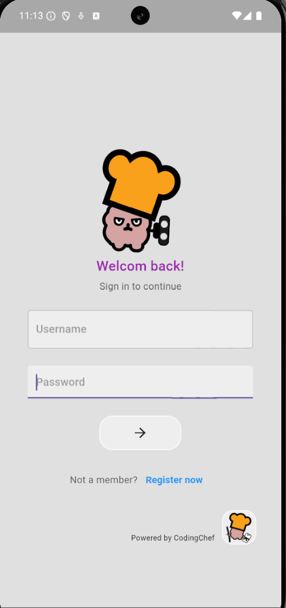

# login_app

A new Flutter project.

## Getting Started

This project is a starting point for a Flutter application.

A few resources to get you started if this is your first Flutter project:

- [Lab: Write your first Flutter app](https://docs.flutter.dev/get-started/codelab)
- [Cookbook: Useful Flutter samples](https://docs.flutter.dev/cookbook)

For help getting started with Flutter development, view the
[online documentation](https://docs.flutter.dev/), which offers tutorials,
samples, guidance on mobile development, and a full API reference.
# login_app

애니메이션이 적용된 login 화면 구현

- flutter_animate 적용
- Boxfit, constraints, static 개념 학습
- MediaQuery, SingleChildScrollView 위젯을 활용한 반응형 레이아웃 적용
- 중복 코드 리펙토링 진행

